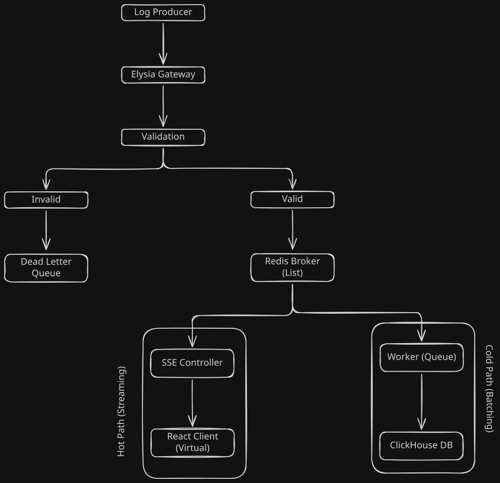

# Watchtower

A self-hosted log ingestion and observability pipeline. Logs come in over HTTP, land on a Redis list, get drained and batched into ClickHouse by a worker, and stream live to every connected browser over SSE. No queue broker, no auth, no nonsense — just the smallest set of moving parts that still behaves like a real observability system under load.

This README is mostly the story of getting from a naive first pass to **8.5k req/s** on a single thread, including the part where moving to "real" infrastructure made everything four times slower before it got faster.

```
status: feature-complete for MVP · single-node · self-hosted
```

---

## Architecture



*Editable source: [`docs/architecture.excalidraw`](docs/architecture.excalidraw) — open at [excalidraw.com](https://excalidraw.com) and drop the file in.*

The split that matters: **ingestion and persistence are decoupled by the Redis list itself.** The gateway's only job on the write path is to validate, push onto Redis, and return — it never waits on ClickHouse. The worker doesn't care how fast logs arrive; it drains in batches on its own schedule. That decoupling is what let me chase throughput on the ingest side without write latency downstream ever showing up in the request path. The dead letter queue exists so a malformed payload fails loudly and visibly instead of silently vanishing or crashing the gateway for everyone behind it in the request queue.

---

## The throughput story

This is the part of the project that actually taught me something, so it gets the long version.

### Round 1 — everything on one machine: 3.5k req/s

First working version: app server, Redis, and ClickHouse all on the same box. Stack was `ioredis` + `BullMQ` for the queue, and the ingest handler looked roughly like:

```ts
await Promise.all([
  redis.lpush(key, payload),
  queue.add("persist", payload),
]);
```

This held a steady **3.5k req/s**, and I assumed that was close to the ceiling for a single Bun process — disk I/O, V8/JSC overhead, whatever. It felt like a hardware-shaped number, so I didn't question it yet.

### Round 2 — splitting the infra: it gets *worse*

I set up a homelab on an old laptop and moved Redis and ClickHouse over there, keeping only the application code on my dev machine. The idea was to stop fighting my own machine's resources while developing and to get a setup that actually resembled a real deployment — app and data layer on different boxes, talking over a network.

Throughput collapsed to **under 500 req/s.**

My first guess was the obvious one: it's the old laptop. Slower disk, weaker CPU, that's just what you get from repurposed hardware. I spent real time on that theory before admitting it didn't hold up — the laptop wasn't *that* old, and the drop was far too large to be explained by disk speed alone for workloads that were mostly memory and network bound.

So I went looking properly, and found two real problems:

- **No connection pooling.** Every request path was capable of opening connections ad hoc instead of reusing a bounded pool, which is invisible on `localhost` (~0ms round trip) and expensive the moment there's real network latency in between.
- **No cap on concurrent in-flight requests**, so load wasn't being shaped at all — it was just however much hit the server at once.

Fixing both helped, but the server was still nowhere near where it should've been. The actual culprit turned out to be the line I'd had since round one and never suspected:

```ts
await Promise.all([...])
```

On localhost, `Promise.all` over two near-instant operations costs nothing — both resolve before you'd notice. The moment one of those operations is a real network round trip to a different machine, `await`-ing the combined promise inside the request handler blocks that handler on the *slower* of the two, for every single request, serializing what should have been fire-and-forget work. It wasn't a hardware ceiling. It was a single keyword turning a non-blocking write into a blocking one, hidden by zero-latency local testing.

### Round 3 — removing the block, removing the queue: 8.5k req/s

Two changes landed together:

1. **Stopped awaiting the write path in the request handler.** The ingest route pushes and returns; it doesn't wait around for confirmation that downstream work finished.
2. **Dropped `ioredis` + `BullMQ` for `bun:redis` and plain Redis lists.** BullMQ gives you retries, delayed jobs, and persistence guarantees I genuinely didn't need — a queue's safety machinery is overhead when all I'm doing is draining a list in order. The worker now just `LPOP`s in batches and writes to ClickHouse on its own cadence; I'd actually built the batching logic for this *before* I'd diagnosed the `Promise.all` issue, while still trying to fix throughput by smoothing out write pressure — it turned out the batcher was a real win on its own, independent of the bigger bug.

Isolated test — ingest only, no SSE clients connected, no frontend running — hit **8.5k req/s on a single thread.**

With the full system attached (SSE fan-out live, frontend connected and rendering), steady-state today averages **6.5k req/s.** That gap is the honest cost of actually doing something with the data instead of just measuring how fast you can throw it away, and it's a number I'm comfortable with for a single-node setup.

### The tradeoff I made on purpose

`bun:redis` over `ioredis` is a deliberate choice of **performance over safety.** I lose automatic reconnect/retry semantics and the durability guarantees BullMQ gave me for free — if the worker dies mid-batch, those logs are gone, not requeued. For a personal observability tool where the worst case is "lost some logs during a crash I'd notice immediately," that's a trade I'd make again. I would not make the same call for anything billing-adjacent or anything where "we silently lost data" is a sentence someone has to say to a customer.

---

## The frontend story

The backend work was about removing blocking. The frontend work was about removing weight.

**The problem:** the log table held every log it had ever seen in component state. At 50,000 logs, a single browser tab sat at **2.7GB of memory** and every new log triggered a re-render of state that was mostly off-screen anyway.

**What fixed it:**

- **A ring buffer (`useRingBuffer`)** replacing the array-that-only-grows. Dropped the cap from `MAX_LOGS = 50_000` to `MAX_LOGS = 2_000` — for a *live tail*, nobody is meaningfully reading log #48,000 in an unbounded in-memory list anyway; a bounded, recent window is the actually-useful product, not a limitation.
- **A virtualizer**, so the DOM only ever renders the rows in viewport regardless of buffer size.
- **Dropped TanStack Table and TanStack Form entirely** in favor of a lightweight, purpose-built DOM for the log rows. Both are excellent general-purpose tools; this isn't a general-purpose table — it's a single, narrow, high-frequency-update view, and the abstraction overhead of a generic table layer was costing more than it was buying.
- **Hook separation by concern, not by file:**
  - `useRingBuffer` — owns the bounded buffer and eviction, knows nothing about the network.
  - `useLogStream` — owns the SSE connection lifecycle (connect, reconnect, teardown), knows nothing about rendering.
  - `useLiveLogs` — composes the two for the component, so the component itself just renders whatever it's handed.
- **TanStack Query + router search-params as the source of truth for filters.** Search/filter state lives in the URL, not component state, so a refresh, a shared link, or a back-button press all land you exactly where you were — continuity without a single `useState` holding filter values.

Result: 50,000 logs' worth of streaming throughput, **under 200MB** in a tab, consistently, instead of 2.7GB.

---

## A ClickHouse ordering bug worth mentioning

Logs were occasionally rendering slightly out of order even though ingestion was sequential. The query had `ORDER BY timestamp DESC` with `id ASC` as a tiebreaker for rows sharing a timestamp — except ClickHouse doesn't guarantee row order for ties the way a single-leader OLTP database does, so `id ASC` as a *final decider* wasn't actually deciding anything reliably. The fix wasn't a ClickHouse setting — it was admitting the tiebreaker logic itself was the bug, and reworking the sort key so ordering didn't depend on an assumption ClickHouse never made.

---

## Quickstart

```bash
git clone https://github.com/penzulo/watchtower.git
cd watchtower
bun install

# infra: redis + clickhouse (see docker-compose.yml)
docker compose up -d redis clickhouse

# env
cp apps/server/.env.example apps/server/.env
cp apps/client/.env.example apps/client/.env

# run
bun run dev          # starts apps/server + apps/client via concurrently
```

| Service | Default port |
|---|---|
| API server | `3000` |
| Client (Vite) | `5173` |
| Redis | `6379` |
| ClickHouse HTTP | `8123` |

Send a log:

```bash
curl -X POST http://localhost:3000/api/v1/logs/batch \
  -H "Content-Type: application/json" \
  -d '[{"service":"api-server","level":"info","message":"hello watchtower","environment":"production","timestamp":"2026-06-28T00:00:00Z"}]'
```

---

## Stack

**Backend** — Bun, Elysia, TypeBox (schema validation), `bun:redis`, ClickHouse

**Frontend** — React, Vite, TanStack Query/Router/Virtual, React Compiler

**Infra** — Docker Compose, monorepo (`server`, `client`, `shared`), Eden Treaty for end-to-end types

## Status

Feature-complete for MVP. No auth, by choice — see the app's landing page for why. Next up: per-source API keys with rate limiting, real alerting (the card in the dashboard is currently a placeholder), and horizontal scaling past a single Bun process.
